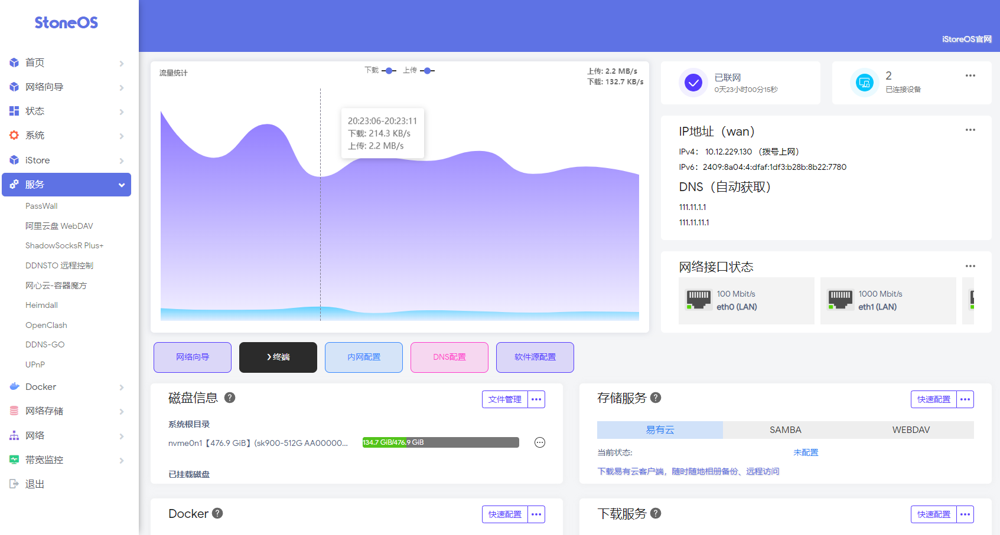

<h1 align="center">StoneOS</h1>

           

# StoneOS-Build
云编译OpenWRT固件

后台地址:192.168.11.252

后台密码:password

# 编译简要说明：
固件信息里的时间为编译开始的时间，方便核对上游源码提交时间

自定义主题 主机名 管理地址 编译源码：.github/workflows/OpenWrt-Build.yml

自定义固件配置：Config/General.txt

自定义编译机型：Config/Rockchip.txt

自定义添加软件包：Scripts/Plugins.sh

自定义DIY脚本：Scripts/Settings.sh

固件每天24点自动编译

## 鸣谢

- [istoreos](https://github.com/istoreos/istoreos)
- [P3TERX/Actions-OpenWrt](https://github.com/P3TERX/Actions-OpenWrt)
- [Microsoft Azure](https://azure.microsoft.com)
- [GitHub Actions](https://github.com/features/actions)
- [OpenWrt](https://github.com/openwrt/openwrt)
- [Lean&#39;s OpenWrt](https://github.com/coolsnowwolf/lede)
- [tmate](https://github.com/tmate-io/tmate)
- [mxschmitt/action-tmate](https://github.com/mxschmitt/action-tmate)
- [csexton/debugger-action](https://github.com/csexton/debugger-action)
- [Cowtransfer](https://cowtransfer.com)
- [WeTransfer](https://wetransfer.com/)
- [Mikubill/transfer](https://github.com/Mikubill/transfer)
- [softprops/action-gh-release](https://github.com/softprops/action-gh-release)
- [ActionsRML/delete-workflow-runs](https://github.com/ActionsRML/delete-workflow-runs)
- [dev-drprasad/delete-older-releases](https://github.com/dev-drprasad/delete-older-releases)
- [peter-evans/repository-dispatch](https://github.com/peter-evans/repository-dispatch)
